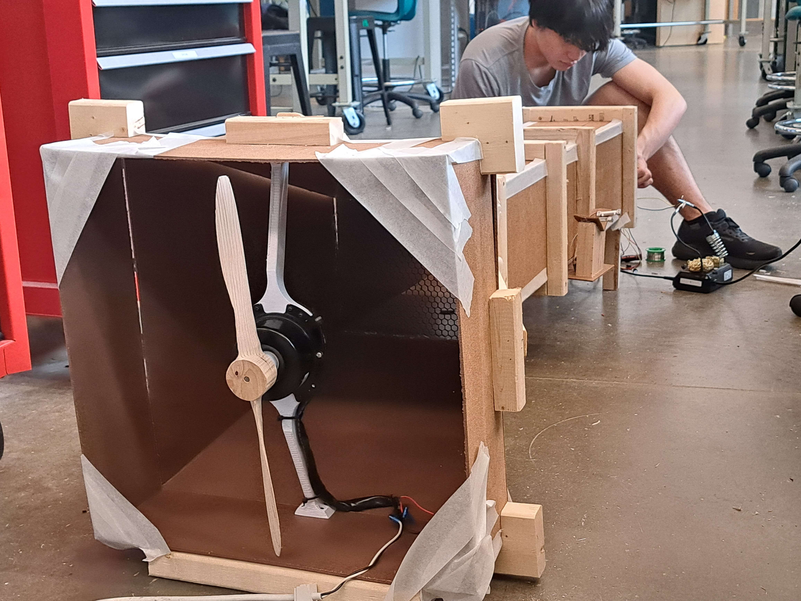
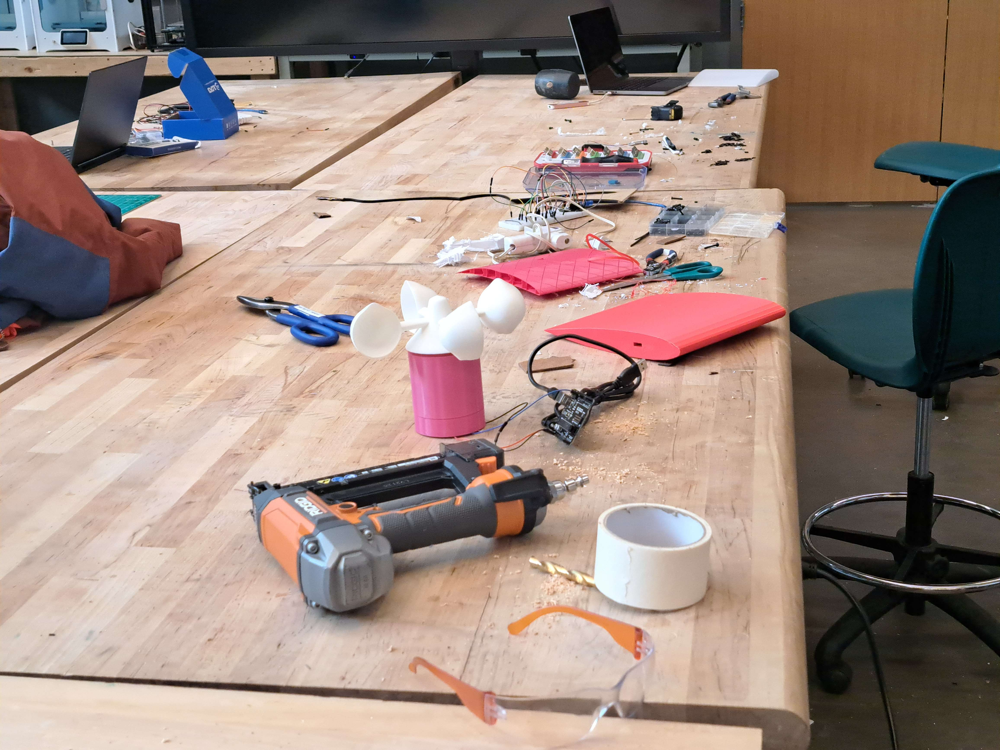
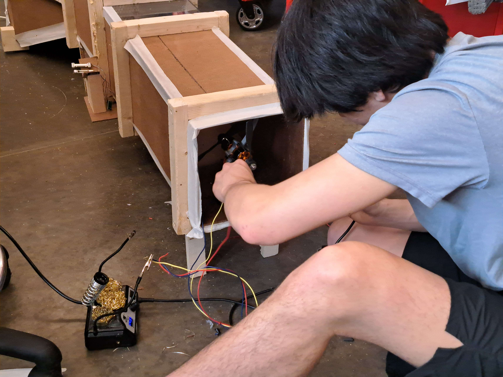

# HackFax 2025: Crossectional Airfoil Wind Tunnel Testing UI

For HackFax 2025 my team built a wind tunnel from scratch and I designed a custom UI for the physical wind tunnel system that measures drag and lift on airfoils using load cells and an anemometer. Built entirely from scratch in Vim and tmux with no external libraries, the interface communicates with the tunnel via the Web Serial API to stream real-time sensor data, control wind speed, and generate aerodynamic profiles at varying angles of attack. A hand made canvas graphing engine renders dynamic plots for lift and drag analysis, enabling precise aerodynamic characterization.

## Physical Wind Tunnel

